# Hi, I'm Akram

CS and Finance student at George Washington University. I'd rather build the thing than talk about building the thing, and most of what I know I learned by shipping real projects.

Right now I'm a software engineering intern at **[Mishwar](https://www.mishwarsyria.com)**, a food-court startup in Syria. I built their website and a full point-of-sale system from scratch to replace a setup that was running ten vendors on pen and paper: ordering, kiosks, a live floor view, and per-vendor sales reports at close.

I work with AI tools every day for real work, not demos. Anthropic-certified in AI Fluency and Claude Cowork. Grew up in Beirut, trilingual in Arabic, English, and French.

### What I work with

### A bit more

- Studying Computer Science **and** Finance. I added Finance after realizing at Mishwar that I cared as much about which stalls made money as I did about the code.
- Former varsity basketball captain. Still competitive about basically everything.
- Windows Insider, so I get to break pre-release builds before everyone else does.

### GitHub

  

### Reach me

[Portfolio](https://github.com/Akram-Atassi) · [LinkedIn](https://www.linkedin.com/in/akramatassi) · akramatassi07@gmail.com
